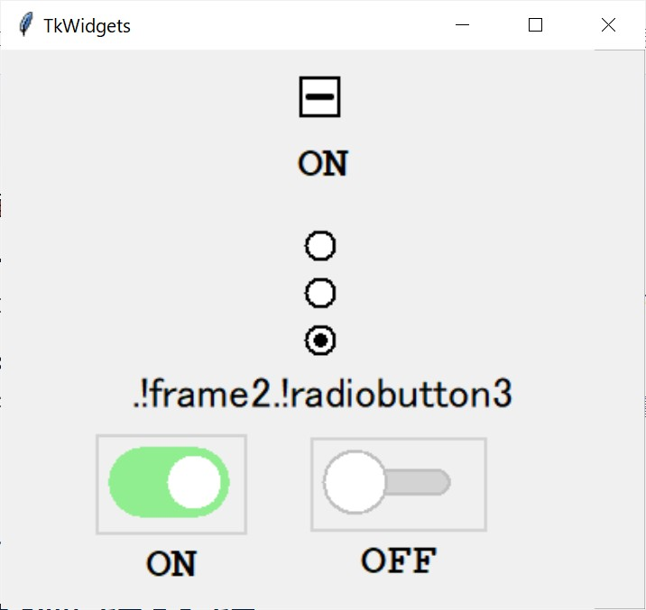

# TkWidgets

このプロジェクトは、`CheckButton`、`RadioButton`、`ToggleButton`などのカスタムTkinterウィジェットのコレクションです。  
標準のTkinterウィジェットと比較して、デザインと機能の面でより柔軟で拡張性のあるインターフェースを提供します。  

## 主な特徴

- **`CheckButton`**: 3つの状態（`UNCHECKED`、`CHECKED`、`INDETERMINATE`）を持つカスタムチェックボタン。
- **`RadioButton`**: 同じグループ内で1つのオプションのみを選択可能なカスタムラジオボタン。
- **`ToggleButton`**: `ON`と`OFF`を切り替えられるカスタムトグルボタン。

さらに、これらのウィジェットを用いた簡単なTkinter GUIデモを含んでいます。

## スクリーンショット

以下は、ウィジェットを使用したサンプルGUIのスクリーンショットです。



## インストール方法

1. **リポジトリをクローン**します:

    ```bash
    git clone https://github.com/yourusername/TkWidgets.git
    cd TkWidgets
    ```

2. **デモを実行**します:

    ```bash
    python3 -m tkwidgets

